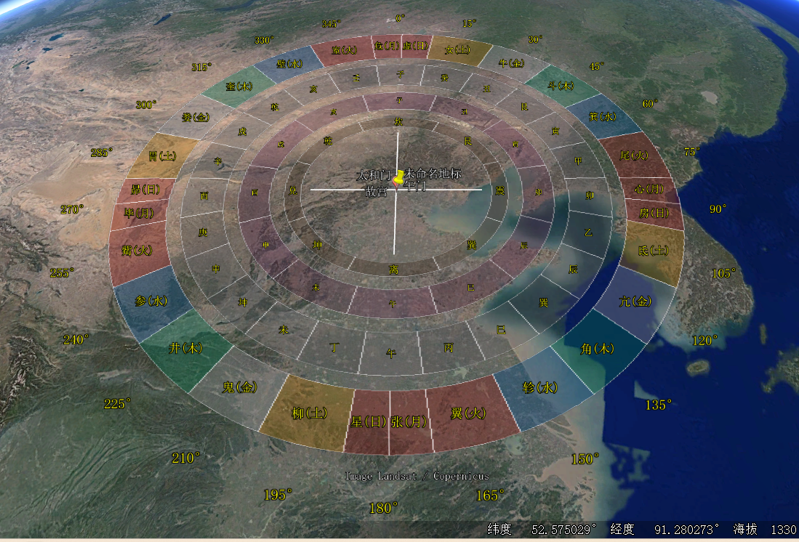

# PyLuoPan

一个Python脚本，用于生成专业、高度可定制化的KML文件，将中国传统天文地理及宇宙观模型（如二十八宿、二十四山、十二地支、八卦等）在Google Earth上进行多层同心环的可视化。

**核心功能:**

- **多环系统**: 支持最多四层同心环，每层数据和设计均可独立配置。
- **数据驱动**: 可轻松更新和修改各环层的方位数据。
- **高度可配置**: 仅需修改脚本顶部的几个参数，即可定义图谱的中心、尺寸、厚度和间距。
- **显示优化**: 所有文字标签均采用“光晕”效果，确保在任何卫星地图背景下都清晰易读。

## 原理

1. 使用python生成kml罗盘
2. 罗盘导入google earth进行风水分析。

## 使用方法

1. google earth标注欲分析位置的坐标
2. 将欲分析坐标和半径填入`xxx.py`
3. 执行代码

```bash
python3 28xiu+24shan+12dizhi+8卦.py
```

```bash
# --- 设置圆心坐标 (纬度, 经度) ---
CENTER_LATITUDE =  39.911198  # 北京故宫
CENTER_LONGITUDE = 116.380719

# --- 设置四环参数 (单位：米 或 百分比) ---
RING_1_OUTER_RADIUS_METERS = 1000 # 环1 (最外层: 二十八宿) 的外部半径
```

## 文件结构

├─database  # 设计元数据
├─image     # 导入googleearth后的截图
├─kml       # 已经生成的kml文件
└─source    # 源代码

### 案例




## 脚本功能说明

1. 绘制一个圆，周围标注刻度坐标
2. 绘制二十八星宿圆环，标准五行属性
3. 绘制二十四山圆环
4. 绘制十二地支圆环
5. 绘制八卦圆环
6. 圆心标注十字坐标
